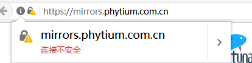

# 局域网环境安装清华大学tuna mirror web

公司现有VPN网的Mirror Server系统是RedHat 7.6，此次使用RedHat 7.6纯局域网安装。
>RedHat 7.6

*tuna mirror很多都是两年前提交的代码，严重怀疑是不是有bug*

#### 1、安装nodejs ruby rubygems
```shell
# yum install -y nodejs
# yum install -y gcc-c++ patch readline readline-devel zlib zlib-devel libyaml-devel libffi-devel openssl-devel make bzip2 autoconf automake libtool bison iconv-devel sqlite-devel

Loading support for Red Hat kernel ABI
Setting up Install Process
No package libyaml-devel available.
No package libffi-devel available.
No package iconv-devel available.
Nothing to do
*没有找到libyaml-devel和libffi-devel是因为我只试用了epel源，把centos的源加上之后就OK了，iconv-devel是因为无需安装，已经在glibc库中提供，后续不影响使用*

# wget https://cache.ruby-lang.org/pub/ruby/2.6/ruby-2.6.5.tar.gz
# tar zxvf ruby-2.6.5.tar.gz
# cd ruby-2.6.5
# ./configure
# make && make install

# wget https://rubygems.org/rubygems/rubygems-3.1.1.tgz
# tar zxvf rubygems-3.1.1.tgz
# cd rubygems-3.1.1
# ruby setup.rb
```
#### 2、安装 bundle 和 build
```shell
# gem install bundle
# gem install build
*下面这行，官方页面没有写。因此后面的jekyll命令无法执行*
# gem install jekyll bundler
```
gem安装需要连接外网，或者更改rubygem的源地址为本地。
```shell
# gem sources  *查看当前使用的源地址*
# gem sources --remove https://rubygems.org/     *删除默认的源地址*  
# gem sources --add http://mirrors.phytium.com.cn/rubygems/   *添加新的源地址，后面一定要记得斜杠符号*
# gem sources -l  *检测添加源地址是否成功*
*** CURRENT SOURCES ***
https://mirrors.tuna.tsinghua.edu.cn/rubygems/
# gem sources -u  *更新源地址的缓存*
```

#### 3、下载 tuna_mirror-web 安装bundler
```shell
# yum install -y git
# cd $HOME
# git clone https://github.com/tuna/mirror-web.git
# cd mirror-web
# mkdir -p static/status
# wget https://mirrors.tuna.tsinghua.edu.cn/static/tunasync.json -O static/tunasync.json
# wget https://mirrors.tuna.tsinghua.edu.cn/static/tunet.json -O static/tunet.json
# wget https://mirrors.tuna.tsinghua.edu.cn/static/status/isoinfo.json -O static/status/isoinfo.json
```
```shell
# bundler install
*bundler install 默认会去外网清华源下载相关软件，必须要将源地址改成本地源，通过寻找发现./Gemfile 为源地址指向文件*
source 'http://内网源服务器地址/mirror/rubygems/'   *将Gemfile文件中的清华大学源地址改成内网源服务器地址*
# jekyll build
*报错You have already activated rouge 3.25.0, but your Gemfile requires rouge 3.23.0. Prepending 'bundle exec' to your command may so *** *
# bundle update rouge   *没有用，无法升级*
然后仔细寻找发现./Gemfile.lock中有软件指定版本信息。把rouge (=3.23.0) 改成 rouge (=3.25.0)
# jekyll build   *再次运行就不会报错了
# jekyll server -H IP地址 -P 端口
```

##### 3-1 tuna_mirror-web 目录结构

```text
.
├── _config.yml       *网页全局配置信息*
├── _data
|   └── options.yml   *首页源列表的解释*
├── _includes
|   ├── footer.html
|   └── header.html
├── fancy-index
|   ├── after.html
|   └── before.html
├── _layouts     *大概html页面源代码*
|   ├── help.html
|   ├── news.html
|   └── index.html
├── help
|   └── _posts
|       └── 1970-01-01-ubuntu.md    *各种源的帮助文档*    
├── _site         *jekyll server生成的静态网页都保存在这个文件夹，后续nginx把主页链接到这个目录即可正常显示，每次更改网页信息后都要jekyll 生成新的静态网页*
├── _plugins
|   └── select.rb
├── news
|   └── _posts
|       └── 2018-04-01-oh-my-tuna.md    *各种新闻* 
├── static
|   ├── css
|   ├── fonts
|   ├── img
|   ├── js
|   ├── njs
|   ├── status
|   |   └── isoinfo.json    *首页显示iso和应用工具安装包下载列表,isoinfo.json 是由脚本 /geninfo/genisolist.py 定时生成 *
|   ├── tunet.json    *tunet.json 直接由 nginx 产生，用于判断用户是否在校园网内，目前该功能已经废除 *
|   └── tunasync.json    *首页显示的源列表,tunasync.json 由 nginx 反代给 tunasync 的 manager，由 manager 产生输出 *
├── geninfo
|   ├── genisolist.ini
|   └── genisolist.py
├── index.html
├── news.html
├── status.html
├── 404.html
└── help.html
```
##### 3-2 mirror-web 文件详解
```shell
*本 Repo 是镜像站前端网页，是纯静态的。它与后端通信的接口有 3 个，是 JSON 文件*
https://mirrors.tuna.tsinghua.edu.cn/static/tunasync.json          *用于获取源文件的同步状态*
https://mirrors.tuna.tsinghua.edu.cn/static/tunet.json             *用于判断用户是否在清华校内*
https://mirrors.tuna.tsinghua.edu.cn/static/status/isoinfo.json    *用于获取 ISO 镜像的信息，供“获取下载链接”按钮使用*
```
tunasync.json 由 nginx 转发到 tunasync manager 处理，转发到 tunasync manager 的 /jobs 接口，相关代码在 https://github.com/tuna/tunasync/blob/ef78563b8cef311ca57f4f0b02b40764dc4b091d/manager/server.go#L75 和 https://github.com/tuna/tunasync/blob/ef78563b8cef311ca57f4f0b02b40764dc4b091d/manager/server.go#L130 ;  
tunet.json 是直接由 nginx 判断返回 true 或者 false，目前由于基础设施升级，该功能不需要了，因此一律返回 false;  
其中，isoinfo.json 是静态文件，由./geninfo/genisolist.py 定时生成；


#### 4、Nginx
nginx本身安装几乎是傻瓜式的。tuna-mirror-web的首页显示都只需要nginx的基本功能，甚至apache也可以完成。但是源文件目录优化显示，需要用到nginx的njs 模块和 fancy_index 模块。
```shell
ngx_http_js_module
ngx_http_fancyindex_module
```

##### 4-1 yum/rpm install
```shell
# yum install nginx 
# nginx -V
nginx version: nginx/1.16.1
built by gcc 4.8.5 20150623 (Red Hat 4.8.5-44) (GCC) 
built with OpenSSL 1.1.1c FIPS  28 May 2019 (running with OpenSSL 1.1.1g FIPS  21 Apr 2020)
TLS SNI support enabled
configure arguments: --prefix=/usr/share/nginx --sbin-path=/usr/sbin/nginx --modules-path=/usr/lib64/nginx/modules --conf-path=/etc/nginx/nginx.conf --error-log-path=/var/log/nginx/error.log --http-log-path=/var/log/nginx/access.log --http-client-body-temp-path=/var/lib/nginx/tmp/client_body --http-proxy-temp-path=/var/lib/nginx/tmp/proxy --http-fastcgi-temp-path=/var/lib/nginx/tmp/fastcgi --http-uwsgi-temp-path=/var/lib/nginx/tmp/uwsgi --http-scgi-temp-path=/var/lib/nginx/tmp/scgi --pid-path=/run/nginx.pid --lock-path=/run/lock/subsys/nginx --user=nginx --group=nginx --with-file-aio --with-ipv6 --with-http_ssl_module --with-http_v2_module --with-http_realip_module --with-stream_ssl_preread_module --with-http_addition_module --with-http_xslt_module=dynamic --with-http_image_filter_module=dynamic --with-http_sub_module --with-http_dav_module --with-http_flv_module --with-http_mp4_module --with-http_gunzip_module --with-http_gzip_static_module --with-http_random_index_module --with-http_secure_link_module --with-http_degradation_module --with-http_slice_module --with-http_stub_status_module --with-http_perl_module=dynamic --with-http_auth_request_module --with-mail=dynamic --with-mail_ssl_module --with-pcre --with-pcre-jit --with-stream=dynamic --with-stream_ssl_module --with-google_perftools_module --with-debug --with-cc-opt='-O2 -g -pipe -Wall -Wp,-D_FORTIFY_SOURCE=2 -fexceptions -fstack-protector-strong --param=ssp-buffer-size=4 -grecord-gcc-switches -specs=/usr/lib/rpm/redhat/redhat-hardened-cc1 -m64 -mtune=generic' --with-ld-opt='-Wl,-z,relro -specs=/usr/lib/rpm/redhat/redhat-hardened-ld -Wl,-E'
*没有集成fancy-index 和 njs 模块module，只能单独自行安装*
# rpm -ivh nginx-module-fancyindex-1.16.1-1.el7.ngx.x86_64.rpm  nginx-module-njs-1.16.1.0.3.4-1.el7.ngx.x86_64.rpm
nginx = 1:1.16.1-1.el7.ngx is needed by nginx-module-fancyindex-1:1.16.1-1.el7.ngx.x86_64
nginx = 1:1.16.1-1.el7.ngx is needed by nginx-module-njs-1:1.16.1.0.3.4-1.el7.ngx.x86_64
*报错信息，只能重新下载nginx-1.16.1-1.el7.ngx.x86_64.rpm试试*
# rpm -ivh nginx-1.16.1-1.el7.ngx.x86_64.rpm  nginx-module-fancyindex-1.16.1-1.el7.ngx.x86_64.rpm  nginx-module-njs-1.16.1.0.3.4-1.el7.ngx.x86_64.rpm
*安装暂时未报错。*
```
**yum install的方式有问题，虽然安装成功，但是nginx其实无法和插件关联链接。所以最后选择用源码编译的方式进行安装。**

##### 4-2 ./configure make && make install
```shell
# wget https://nginx.org/download/nginx-1.16.1.tar.gz     * 下载1.16.1版本的nginx源代码
# hg clone http://hg.nginx.org/njs        * 首先要安装一个类似于git的版本管理工具mercurial: yum install mercurial
# git clone https://github.com/aperezdc/ngx-fancyindex       * 注意njs和ngx-fancyindex两个目录与nginx-1.16.1平级
# tar -zxvf nginx-1.16.1.tar.gz
# cd nginx-1.16.1
# ./configure --prefix=/usr/local/nginx --with-http_ssl_module --with-http_v2_module --with-http_realip_module --with-http_addition_module --with-http_image_filter_module --with-http_sub_module --with-http_gunzip_module --with-http_gzip_static_module --with-http_auth_request_module --with-http_slice_module --with-http_stub_status_module --with-mail --with-mail_ssl_module --with-stream --with-stream_ssl_module --with-stream_ssl_module --with-stream_realip_module --with-stream_ssl_preread_module --with-pcre --add-module=../njs/nginx --add-module=../ngx-fancyindex
    *出现 未找到PCRE library和GD library的报错信息，运行下面命令，把几个库给安装上*
# yum -y install zlib zlib-devel openssl openssl-devel pcre pcre-devel gd-devel
# make && make install
# /usr/local/nginx/sbin/nginx -V      * 验证下nginx是否安装正常
# /usr/local/nginx/sbin/nginx         * 启动nginx，看是否有报错信息
```
**测试两个插件是否安装运行正常,一般完整按照此文安装后没有报错信息，可以跳过测试部分**
```shell
编写njs脚本进行测试
# vim /usr/local/nginx/conf/hello_world.js           * 在conf目录下新建测试脚本
function hello(r){
    r.return(200, "Hello world");
}
# mv /usr/local/nginx/conf/nginx.conf /usr/local/nginx/conf/nginx.conf.bak    * 备份nginx原始配置文件
# vim /usr/local/nginx/conf/nginx.conf          * 新建一个nginx测试配置文件
events {
    worker_connections  1024;
}

http {
    js_include hello_world.js; #Added
    include       mime.types;
    default_type  application/octet-stream;
    sendfile        on;
    #tcp_nopush     on;
    #keepalive_timeout  0;
    keepalive_timeout  65;
    #gzip  on;

    server {
        listen       80;
        server_name  localhost;
        #charset koi8-r;
        #access_log  logs/host.access.log  main;

        location / {
            js_content hello; 
        }
    }    
}

# /usr/local/nginx/sbin/nginx    * 启动nginx，或者加上 -s reload 重置nginx
# curl -i localhost              * 如果可以看到输出Hello world.就说明njs插件安装成功
```
```shell
测试fancyindex插件，将nginx.conf配置文件中js_content注释掉，加入两行fancyindex配置命令，重启nginx         
location / {
    #js_content hello; 
    fancyindex on;         
    fancyindex_exact_size off; 
}

* 在/usr/local/nginx/html目录下新建文件夹test，网页访问http://IP/test出现fancyindex页面说明fancy-index插件安装成功
```

GitHub代码维护人员在https://github.com/tuna/mirror-web/issues/233 页面中给出了nginx参考配置，配置如下：
```shell
load_module modules/ngx_http_js_module.so;
load_module modules/ngx_http_fancyindex_module.so;
*早就不需要load_module，特别是手动编译安装的nginx，/usr/local/nginx目录下都没有module文件夹*

map $http_user_agent $isbrowser {
 default 0;
 "~*validation server" 0;
 "~*mozilla" 1;
}

fancyindex_header /fancy-index/before;
fancyindex_footer /fancy-index/after;
fancyindex_exact_size off;
fancyindex_time_format "%d %b %Y %H:%M:%S +0000";
fancyindex_name_length 256;

error_page 404 /404.html;

location /fancy-index {
 internal;
 root /path/to/mirror-web/_site;
 subrequest_output_buffer_size 100k;
 location = /fancy-index/before {
   js_content fancyIndexBeforeRender;
 }
 location = /fancy-index/after {
   js_content fancyIndexAfterRender;
 }
}

js_path /path/to/mirror-web/static/njs;
js_include /path/to/mirror-web/static/njs/all.njs;
*js_path在njs插件0.4.0版本之后去除了，所以必须注释掉，而且js_include必须写在前面，不然报错*

location / {
 root /path/to/mirrors;
 fancyindex on;
}
```
最后附上实际环境的nginx.conf配置文件
```shell
events {
    worker_connections  1024;
}

http {
     js_include /usr/local/nginx/html/static/njs/all.njs;

     map $http_user_agent $isbrowser {
         default 0;
         "~*validation server" 0;
         "~*mozilla" 1;
     } 

    server {
        listen       80;
        server_name  localhost;

        fancyindex_header /fancy-index/before;
        fancyindex_footer /fancy-index/after;
        fancyindex_exact_size off;
        fancyindex_time_format "%d %b %Y %H:%M:%S +0000";
        fancyindex_name_length 256;

        error_page 404 /404.html;

        location /fancy-index {
                internal;
                root /usr/local/nginx/html;
                subrequest_output_buffer_size 100k;
                location = /fancy-index/before {
                      js_content fancyIndexBeforeRender;
                }
                location = /fancy-index/after {
                     js_content fancyIndexAfterRender;
                }
        }

        location / {
            root /usr/local/nginx/html;
            fancyindex on;              # Enable fancy indexes.
        }
    }
}
```
**以为一切正常，后续却发现，网页页面显示不正常。一开始没有强制删除缓存刷新，所以没发现。最后开始漫长的测试环境搭建和对比验证。**
```shell
虚拟机搭建RHEL 7.6测试环境

# yum install httpd        * 安装apache来测试下网页
更改http配置文件html的显示路径后启动apache服务。
网页正常显示！说明和服务器本身配置没有关系。纯属是nginx服务有问题。

# yum install nginx      * yum安装nginx，好像连同安装了nginx-filesystem
# nginx -V     * 查看nginx版本
1.21.1
# systemctl start nginx     * 更改配置文件/etc/nginx/nginx.conf中html显示路径后启动nginx服务
网页正常显示！

# wget https://nginx.org/download/nginx-1.16.1.tar.gz     * 下载nginx 1.16.1版本
# tar -zxvf nginx-1.16.1.tar.gz
# cd nginx-1.16.1
# ./configure --prefix=/usr/local/nginx --with-http_ssl_module --with-http_v2_module --with-http_realip_module --with-http_addition_module --with-http_image_filter_module --with-http_sub_module --with-http_gunzip_module --with-http_gzip_static_module --with-http_auth_request_module --with-http_slice_module --with-http_stub_status_module --with-mail --with-mail_ssl_module --with-stream --with-stream_ssl_module --with-stream_ssl_module --with-stream_realip_module --with-stream_ssl_preread_module
# make && make install      * 不带任何第三方插件安装
# /usr/local/nginx/sbin/nginx     * 更改配置文件/usr/local/nginx/conf/nginx.conf中html显示路径后启动nginx服务
网页正常显示！

下载njs和ngx-fancyindex，njs版本为0.6.1，ngx-fancyindex版本为0.5.1。
# ./configure --prefix=/usr/local/nginx --with-http_ssl_module --with-http_v2_module --with-http_realip_module --with-http_addition_module --with-http_image_filter_module --with-http_sub_module --with-http_gunzip_module --with-http_gzip_static_module --with-http_auth_request_module --with-http_slice_module --with-http_stub_status_module --with-mail --with-mail_ssl_module --with-stream --with-stream_ssl_module --with-stream_ssl_module --with-stream_realip_module --with-stream_ssl_preread_module --with-pcre --add-module=../njs/nginx --add-module=../ngx-fancyindex
# make && make install
添加两个第三发插件后覆盖安装，更改配置文件后启动nginx服务。
网页正常显示！  
接下来把配置文件再次复制粘贴到nginx.conf中，重启nginx，网页正常显示！这......  
个人认为原因应该是首次编译安装nginx后，再次添加模块后编译安装，没有运行make install，而是把make后产生的/objs/nginx复制到/usr/local/nginx/sbin/进行替换导致的。待后续有机会再验证。
```

设置nginx开机自启动
```shell
# vim /lib/systemd/system/nginx.service       * 在系统的/lib/systemd/system/目录下创建 nginx.service文件
[Unit]
Description=nginx service
After=network.target 
   
[Service] 
Type=forking 
ExecStart=/usr/local/nginx/sbin/nginx
ExecReload=/usr/local/nginx/sbin/nginx -s reload
ExecStop=/usr/local/nginx/sbin/nginx -s stop
PrivateTmp=true 
   
[Install] 
WantedBy=multi-user.target

# chmod a+x /lib/systemd/system/nginx.service

systemctl enable nginx.service          * 设置开机自启动
systemctl disable nginx.service         * 设置开机不启动
systemctl start nginx.service　         * 启动 Nginx 服务
systemctl stop nginx.service　          * 停止服务
systemctl status nginx.service          * 查看服务当前状态
```

完善web网页细节
```shell
将nginx的配置文件中关于网页的主目录指向代码改成tuna_mirror-web中的_site目录  
或者将jekyll build生产的_site网页文件移动到nginx的默认目录
location / {
    root /date/web/tuna_mirror_web/_site;
    fancyindex on;
}
为方便更新网页便利以及源文件和网页分开存放。我们一般通过软链接把源文件链接到网页目录下，比如  
# ln -s 源文件地址 链接文件地址
# ln -s /data/mirror/kylin /data/html/
有时候也可以将整个文件夹所有的文件夹都链接到网页目录下。不用一一操作
# ln -s /data/mirror/* /data/html/
# rm -rf /data/html/kylin      *删除链接文件时，千万不要在链接文件后面接 / 只写文件夹名*
```

**后续添加源的操作手册（基于实际生产环境）**  
1. 下载源文件存放在/data/mirror文件夹下，创建软链接到网页目录`ln -s /data/mirror/test /data/html`
2. 将此源的相关信息写入/data/tuna_mirror_web/static/tunasync.json
3. 假如是特殊源(清华源没有相关信息)需要在/data/tuna_mirror_web/data/options.yml 文件中加入对该源的解释，以便大家在首页能直观了解
4. 将此源的使用帮助文件放入/data/tuna_mirror_web/help/_posts 目录下，md格式文件
5. 在/data/tuna_mirror_web目录下运行jekyll build命令，生成新的网页数据文件在_site目录下
6. 将_site文件下所有的数据直接拷贝到/data/html目录下
7. 重启nginx服务，甚至重启服务器也行。网页可能刷新几次后还是无法显示新增的源，清除浏览器缓存试试

**自此，RedHat7.6环境下tuna mirror website的前端页面完美安装，后续会更新后台源更新脚本**


#### 5、https
因为tuna mirror web源代码中很多都是用的https，很多帮助文件里面也是写的https网址，而且为了更加安全，所以后期考虑换成https访问。  
https访问需要CA签名证书，但是内网是无法访问那些外网的CA认证机构。所以必须内网自建CA认证服务器，供给其他的应用服务器来做证书申请和颁发。  
后续更新 CA证书服务器的搭建教程

以下主要单独讨论mirror服务器https的访问搭建。

> 安装系统环境 RedHat 7.6
```shell
$ openssl genrsa -des3 -out server.key 2048         *以后每次使用此文件(通过openssl提供的命令或API)都要求输入密码*
$ openssl rsa -in server.key -out server.key        *生成不需要输入密码的key文件替换原来加密的key文件*
$ openssl req -new -key server.key -out server.csr
$ openssl req -new -x509 -key server.key -out ca.crt -days 3650
$ openssl x509 -req -days 3650 -in server.csr -CA ca.crt -CAkey server.key -CAcreateserial -out server.crt
```
将上述命令获取到的两个文件server.crt和server.key的绝对路径写入配置文件nginx.conf中。
```shell
# vim /usr/local/nginx/conf/nginx.conf
server {
        listen       443 ssl;
        server_name  localhost;
        ssl_certificate      /data/html/cert/server.crt;
        ssl_certificate_key  /data/html/cert/server.key;

        ssl_session_cache    shared:SSL:1m;
        ssl_session_timeout  5m;

        ssl_ciphers  HIGH:!aNULL:!MD5;
        ssl_prefer_server_ciphers  on;
        
        fancyindex_header /fancy-index/before;
        fancyindex_footer /fancy-index/after;
        fancyindex_exact_size off;
        fancyindex_time_format "%d %b %Y %H:%M:%S +0000";
        fancyindex_name_length 256;

        error_page 404 /404.html;

        location /fancy-index {
                internal;
                root /data/html;
                subrequest_output_buffer_size 100k;
                location = /fancy-index/before {
                      js_content fancyIndexBeforeRender;
                }
                location = /fancy-index/after {
                     js_content fancyIndexAfterRender;
                }
        }

        location / {
            root   /data/html;
            fancyindex on;
            index  index.html index.htm;
        }
}
# systemctl restart nginx.service       *重启nginx服务*
```
nginx正常启动后，访问正常，但是客户端浏览器会提示链接不安全。  


将刚刚服务器断openssl生成的ca.crt证书导入到客户端机器浏览器的信任证书机构列表中。然后手动信任证书后再次访问网站，就不会黄色的“连接不安全”警告了。  


*有个比较严重的问题，添加ca证书后还要对响应的证书进行单独信任才行，难道不能自建一个可信的CA证书颁发机构，由这个机构颁发的证书默认都是可信状态？*  
*后续更进...*


## RedHat 6.8 源代码编译安装nginx和第三方插件ngx-fancyindex和njs
> RedHat 6.8

其实redhat 6.8安装tuna mirror web和redhat 7.6一模一样。nginx编译安装的时候报了一个错。
`make[1]: Leaving directory ***` 直接忽略。`/usr/local/nginx/sbin/nginx -V`查看是否安装正常。假如安装正常，可更改配置文件后启动nginx查看是否正常显示。  
关于在redhat 6.8中如何让nginx开机自动启动，自行百度。


## Ubuntu 安装测试tuna mirror website
>  Ubuntu 16.04

因为kylin官方源文件的同步下载需要使用apt-mirror，redhat无法安装apt-mirror，所以考虑在ubuntu环境下安装tuna mirror website
### 1、安装ruby等软件
```shell
$ sudo apt-get install ruby ruby-dev make build-essential
$ vim .bashrc     *添加命令*
# Ruby exports
export GEM_HOME=$HOME/gems
export PATH=$HOME/gems/bin:$PATH
$ source .bashrc       *bashrc立即生效*
$ gem install jekyll bundler
```
ubuntu安装jekyll server和redhat还是不相同，可能是缺少前期的软件依赖包，导致最后启动的时候启动不正常。
暂且搁置，等后续有空再进行安装测试。

## 添加kylin源出现的问题
因为kylin v10.1的源文件已经出现了两个源地址。但是两个源地址对应的系统版本号又不相同。一个是10.0  一个是V10；一个是10.1，一个是V10 SP1。
```shell
deb http://archive.kylinos.cn/kylin/KYLIN-ALL 10.1 main restricted universe multiverse
deb http://archive2.kylinos.cn/deb/kylin/production/PART-V10-SP1/custom/partner/V10-SP1 default all
```
在源帮助文件中无法对版本进行唯一的定位。具体文件在`/data/tuna_mirror_web/help/_posts/2022-07-11-kylin-deb.md`
```shell
<form class="form-inline">
<div class="form-group">
    <label>选择你的kylin版本: </label>
    <select class="form-control release-select" data-template="#apt-template" data-target="#apt-content">
      <option data-release="V10">10.0版本</option>
      <option data-release="V10-SP1">10.1版本</option>
    </select>
</div>
</form>


<script id="apt-template" type="x-tmpl-markup">
# 将以下内容直接复制到source.list文件中
deb http://{{ site.hostname }}/kylin/ {{release_name}} main restricted universe multiverse
deb http://{{ site.hostname }}/kylin-deb/production/KY-{{release_name}}-arm64/custom/kylin-desktop/{{release_name}}-arm64 default all
deb http://{{ site.hostname }}/kylin-deb/production/PART-{{release_name}}/custom/partner/{{release_name}} default all
</script>

```

- 针对用户的选择`10.0版本` 和 `10.1版本`，要实现源仓库和官方第三方仓库版本名的统一。所以必须要对这两个进行单独的命名。而命名又是后台js脚本控制的。

脚本文件 `/data/tuna_mirror_web/static/js/help.es6` 其中关键代码以下：

```shell
    var update_apt_file = (ev) => {
        var sel = $(ev.target),
            os_name=sel.find("option:selected").data('os'),
            release_name=sel.find("option:selected").data('release'),
            release_security=sel.find("option:selected").data('security'),
            opt=sel.find('option:selected').data('opt'),
            tmpl_selector=sel.data("template"), 
            target_selector=sel.data("target"),
            apt_template=$.trim($(tmpl_selector).text()),
            tmpl_data=$.extend({}, {
                os_name: os_name,
                release_name: release_name,
                release_security: release_security,
            }, opt),
            apt_content=Mark.up(
                apt_template, 
                tmpl_data
            );
        $(target_selector).html(apt_content);
    };
```

仔细阅读代码后，虽然对es6一无所知，但是单凭感觉，`release_name` 和 `os_name` 很类似于ubuntu系统对版本和代码的命名区分。是不是kylin也可以这么使用。所以根据语法规则，将 `2022-07-11-kylin-deb.md` 改动一下，添加一个 `os_name` 的变量。关键代码如下。测试果然如预期效果一样。

```shell
<form class="form-inline">
<div class="form-group">
    <label>选择你的kylin版本: </label>
    <select class="form-control release-select os-select" data-template="#apt-template" data-target="#apt-content">
      <option data-release="V10" data-os="10.0">10.0版本</option>
      <option data-release="V10-SP1" data-os="10.1">10.1版本</option>
    </select>
</div>
</form>


<script id="apt-template" type="x-tmpl-markup">
# 将以下内容直接复制到source.list文件中
deb http://{{ site.hostname }}/kylin/ {{os_name}} main restricted universe multiverse
deb http://{{ site.hostname }}/kylin-deb/production/KY-{{release_name}}-arm64/custom/kylin-desktop/{{release_name}}-arm64 default all
deb http://{{ site.hostname }}/kylin-deb/production/PART-{{release_name}}/custom/partner/{{release_name}} default all
</script>

```